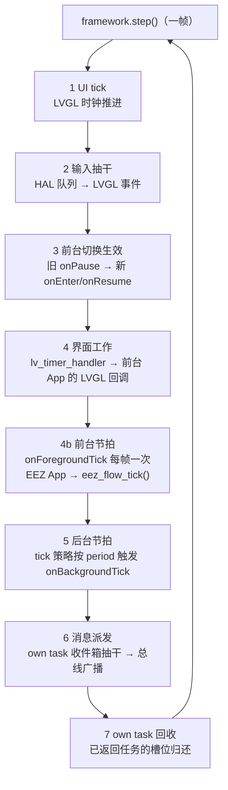
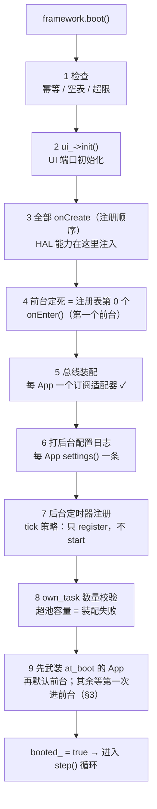
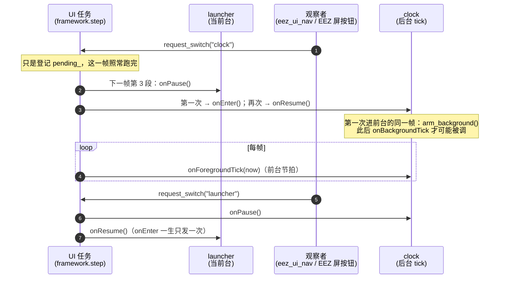
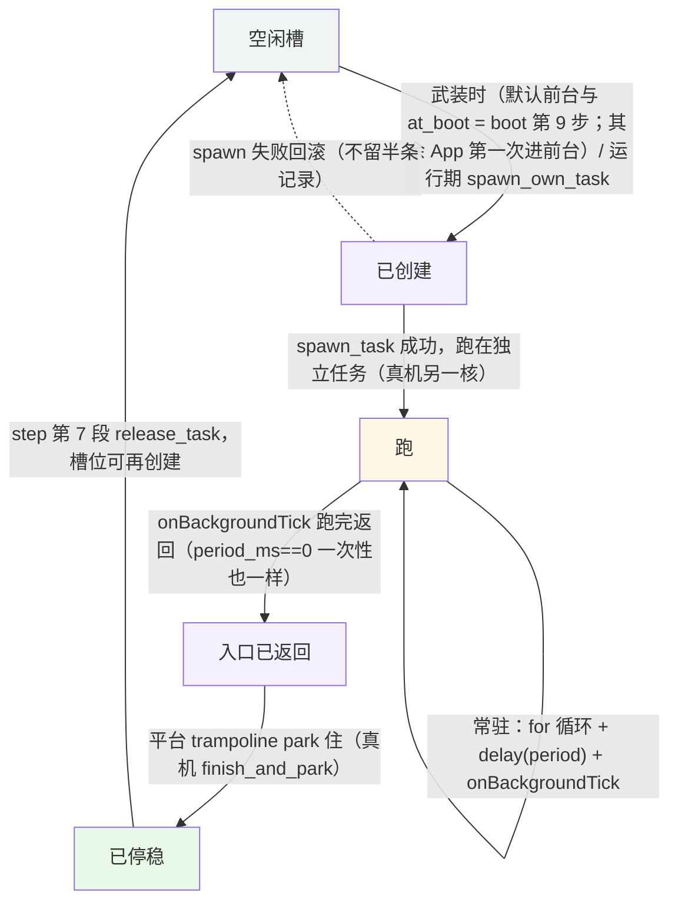
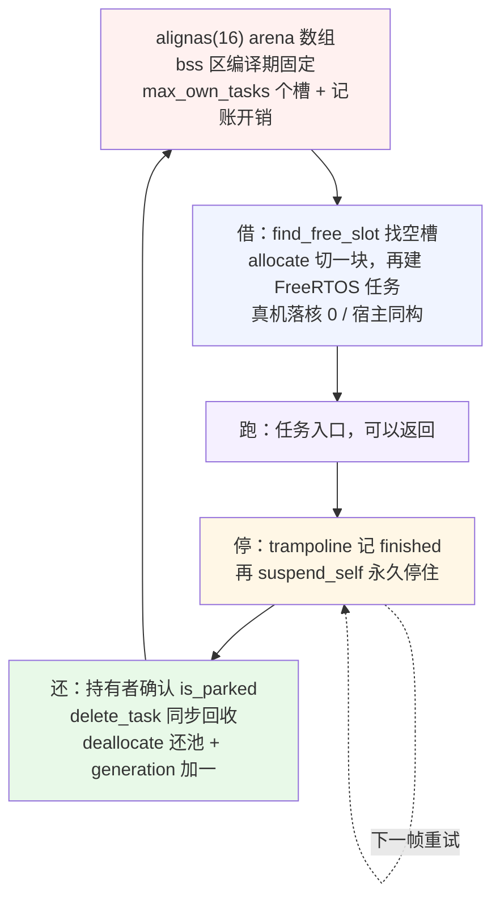

# Embark 运行时机制：前后台切换与后台运行

> 本文件用图讲清楚框架**是怎么跑起来的**：boot 装配顺序、唯一 UI 任务里的每一拍
> 做什么、前台切换在哪一刻生效、三种后台策略各自挂在哪儿、own task 从创建到回收
> 的完整生命周期。看懂这些，写任何 App 都不会在「什么时候被调、在哪条线程上跑、
> 能不能 publish」上犯迷糊。
>
> 对应"怎么用"（示例代码）见 [messages-and-background.md](messages-and-background.md)；
> 契约原文见 [app.h](../../include/embark/app.h)、[framework.h](../../include/embark/framework.h)、
> [task_spawner.h](../../include/embark/task_spawner.h)；
> 决策背景见 [adr/0001](../adr/0001-single-ui-task-logic-apps.md)、[0004](../adr/0004-background-tick-and-state-policy.md)、[0005](../adr/0005-static-task-slots-and-pool.md)。

---

## 一句话核心

**全系统只有一条主线**：唯一 UI 任务在跑 `framework.step()`（宿主默认 5 ms 一拍，
真机按自己的循环周期重排），**一帧 = 7 段**。前后台切换、后台节拍、own task 的
消息与回收，全部挂在这一帧里；没有第二条驱动循环。装配则是 boot 一次做完的：
生命周期钩子、总线订阅、后台策略，全在进入循环前就位。

## 1. 一帧 step 的 7 段



| 段 | 做的事 | 谁的钩子被调 |
| --- | --- | --- |
| 1 | UI 时间轴（LVGL tick） | — |
| 2 | 输入事件处理（抽干 HAL 输入队列） | — |
| 3 | 边界切换 `apply_pending_switch` | 旧前台 `onPause`，新前台 `onEnter`/首个 `onResume` |
| 4 | 界面工作（`lv_timer_handler`） | 前台 App 的 LVGL 回调（事件） |
| 4b | 前台节拍 | 前台 App `onForegroundTick`（EEZ 用它驱动 `eez_flow_tick`） |
| 5 | 后台节拍 | tick 策略 App 的 `onBackgroundTick`（按各自周期） |
| 6 | 消息派发 | 每个 App 的 `onMessage`（收件箱信封 + 同帧 publish 的消息） |
| 7 | own task 回收 | 入口已返回的任务 → 槽位归还（`reap_finished_own_tasks`） |

## 2. boot()：装配顺序（进入循环之前，一次做完）

`framework.boot()`（[framework.cpp](../../src/embark/framework.cpp) `:16-129`）按固定顺序
把三样东西装好：钩子（生命周期）、总线（消息）、后台（tick 定时器 + own task）。
注意后台是**两段式**：boot 只做「注册 / 校验」，真正**开跑在武装**（4.1）——例外是显式声明 `ArmPolicy::at_boot` 的 App：boot 第 9 步当场武装（4.2）。
**顺序本身就是契约**，每步之间谁先谁后都有原因：



| 步 | 做什么 | 为什么是这个顺序 |
| --- | --- | --- |
| 3 | 全部 `onCreate` | 按注册顺序；HAL 能力（`fw.hal()`）从这里注入 |
| 4 | 前台 = 注册表第 0 个，`onEnter` | 注册顺序即默认前台；第 0 个同时是主屏（ADR 0006） |
| 5 | 总线适配器逐个 `bind + subscribe` | **在 onCreate 之后**：onCreate 里 publish 的消息没人收（记 unknown WARN），装配消息请放 onEnter 之后 |
| 7 | tick 定时器**注册**（不启动） | 周期 = `ceil(period_ms / ui_loop_period_ms)` 个帧（`:87-89`）；宿主 5 ms 一拍，真机按自身循环周期重排。`start` 推迟到武装（4.1；`at_boot` 的 App 在第 9 步就 start）——但容量错误仍在装配期就暴露 |
| 8 | own_task 数量校验 | 声明 `own_task` 策略的 App 数 > `max_own_tasks` → 装配期就 `no_space`（**不进入循环**）；真正的创建推迟到武装（5.2）。声明 `at_boot` 的 own_task 也计入这个预检 |
| 9 | 武装后台策略（两轮） | 先按注册顺序武装所有声明 `ArmPolicy::at_boot` 的 App（4.2），再武装默认前台（注册表第 0 个在 boot 里已经 `onEnter`）；其余 App 等第一次被切进前台（§3）。**任一轮失败 = boot 失败**（不进循环） |

失败时 boot 直接返回具体 Error、**不进入循环**（此时任何 App 的 onExit 都不会被调）。

## 3. 前后台切换：请求只登记，帧边界生效

切换**绝不是请求瞬间发生的**：`request_switch` 只把目标写进 `pending_`，
真正执行在下一帧第 3 段。App 永远无权直接改前台，钩子顺序由框架定死。



钩子全集（[app.h](../../include/embark/app.h) `:95-119`）：

| 钩子 | 何时触发 | 次数 |
| --- | --- | --- |
| `onCreate` | boot 时，按注册顺序 | 一生一次 |
| `onEnter` | 第一次成为前台 | 一生一次（`entered_` 标志保证） |
| `onPause` | 离开前台 | 每次离开 |
| `onResume` | 再次成为前台 | 每次回来（onEnter 之后全是它） |
| `onForegroundTick` | 每帧第 4b 段，仅前台 App | 前台期间每帧一次 |
| `onBackgroundTick` | tick 策略按 period 触发（own_task 在自己的任务里循环） | **武装后**照跑：默认武装 = 第一次进前台，`at_boot` 的在 boot 第 9 步武装（4.2）；之后与前后台无关 |
| `onMessage` | 总线广播（第 6 段） | 每个 App 都收 |
| `onExit` | 仅关机路径（`shutdown`） | 一生一次 |

## 4. 后台运行：三种策略，各挂一处

`BackgroundPolicy` 是每 App 一个的声明、`ArmPolicy` 是武装时机的声明（[app.h](../../include/embark/app.h) `:37-52`），
App 在 `settings()` 里自报家门；框架在 boot 第 7 步注册定时器、第 8 步校验 own_task 容量，
然后在这个 App **第一次进前台**时武装它（4.1）——除非它声明了 `ArmPolicy::at_boot`，那样
boot 第 9 步就武装（4.2）。

| 策略 | 谁在跑 | 挂在哪儿 | 注意 | 仓库例子 |
| --- | --- | --- | --- | --- |
| `suspend`（默认） | 谁也不跑 | — | 最省资源；只在被切到前台时有行为 | settings |
| `tick` | 唯一 UI 任务 | step 第 5 段（ETL callback_timer） | **必须轻量**：阻塞会卡住整个 LVGL 动画；武装之后才 `start`（`at_boot` 的在 boot 第 9 步 start） | clock（100 ms） |
| `own_task` | 独立 FreeRTOS 任务 | 自己的任务（栈深/优先级自配） | 发消息只能 `post()`，不能 `publish()`；完整生命周期见 §5 | 三个 App 都没声明；内核用例 `test_own_task_lifecycle.cpp` |

要点：

- **tick 的精度上限是帧粒度**：周期 = `ceil(period_ms / ui_loop_period_ms)` 个帧
  （framework.cpp `:87-89`）。宿主 5 ms 一拍。
- **后台与前后台无关（武装之后）**：clock 被切走挂起时，它的 `onBackgroundTick` 照样每 100 ms 跑；
  但在默认（`on_first_enter`）下，**第一次进过前台之前这个节拍根本不会开始**——见 4.1；
  声明 `at_boot` 的不等前台，见 4.2。

### 4.1 默认武装时机：第一次进前台才开跑（issue 23 / ADR 0009）

> 一句话：**声明了后台策略 ≠ 一上电就在后台跑**。后台在 App「第一次进过前台」那一刻**武装**
> （内部 `arm_background`），武装一次即长期有效。


| 策略 | 武装这一下做什么 | 失败会怎样 |
| --- | --- | --- |
| `suspend` | 只把 `armed_` 记上（没有后台体） | 不可能失败 |
| `tick`（`period_ms > 0`） | `timers_.start(已注册的定时器)`，周期从此刻起算 | 定时器没注册 → `not_ready` |
| `tick`（`period_ms == 0`） | 视为没有后台体（等同 suspend） | 不可能失败 |
| `own_task` | `spawn_own_task_internal`：经 `ITaskSpawner` 建任务 | `no_space` / `busy` / `unsupported` |

- **默认前台（注册表第 0 个）**在 boot 里就进过前台，所以 boot 当场武装它（失败 = 装配失败、
  不进循环，与以前"own task 装不出来就不进循环"同口径）。
- **运行期武装失败不回滚切换**：前台已经切过去了，只是这个 App 没有后台；记 `ELOG_ERROR`
  + `arm_failures_`（观测 `framework.background_armed(id)` / `framework.arm_failures()`）。
- **武装 ≠ 只在前台之外跑**：武装之后，人在前台时后台也照跑。不是框架不想，而是 `own_task`
  在平台上是一个常驻任务（`for(;;){ delay(period); onBackgroundTick; }`），没有"暂停 / 恢复"
  这一说；框架能约束的只有**什么时候开始跑**。
- **RAM 位语义**：`entered_` 与 `armed_` 都是每次开机清零的内存位，准确说法是
  **"每次开机后被打开过一次才会跑后台"**。真机上"开机就该跑"的 App（闹钟）不再需要这种
  近似：在 `settings()` 里显式声明 `ArmPolicy::at_boot`（见 4.2，issue 24 / ADR 0010）。
- **两种武装时机互斥**：`on_first_enter`（默认）与 `at_boot` 二选一；`at_boot` 的 App 后来被
  切进前台也不会重复武装（`arm_background` 幂等、`armed_` 记账）。

### 4.2 显式 eager：`ArmPolicy::at_boot` 开机即武装（issue 24 / ADR 0010）

> 一句话：默认是"被打开过才跑"（4.1）；闹钟这类"由持久化状态驱动、不依赖用户点开"的 App
> 在 `settings()` 里加第 5 个字段，框架在 boot 第 9 步就把它的后台拉起来。

```cpp
AppSettings settings() const override {
  return AppSettings{BackgroundPolicy::own_task, 50U, 256U, 4U, ArmPolicy::at_boot};
}
```

| 声明 | boot 第 9 步 | 之后第一次进前台 | 典型 |
| --- | --- | --- | --- |
| `ArmPolicy::on_first_enter`（默认） | 只记账（不武装） | 同一帧武装 | clock、所有交互型 App |
| `ArmPolicy::at_boot` | 当场武装（`tick` → `start` 定时器，`own_task` → 建任务） | 不重复武装（`arm_background` 幂等） | 闹钟、上电即采样的服务型 App |

- boot 里 **at_boot 轮在前、默认前台轮在后**，两轮都按注册顺序；**任一轮失败 = 装配失败**
  （boot 返回具体 `Error`、不进循环），与"own task 装不出来就不进循环"同口径。
- `at_boot` 的 `own_task` 计入第 8 步的容量预检（超 `max_own_tasks` 仍是装配期 `no_space`）。
- 代价：这个 App 的前台可能还没加载过，它的后台已经在跑 —— 后台逻辑若依赖 UI 状态
  （控件、屏对象），要自己容忍（等第一次 `onEnter` / `onForegroundTick` 之后再做 UI 相关的事）。
- `at_boot` 只表达"什么时候开始跑"，不表达"跑起来不停"：`armed_` 仍是 RAM 位，每次开机
  重新按声明武装；App 自己的持久化状态（闹钟设了几点）用 `fw.hal().storage` 存。
- 决策背景与弃选方案：[ADR 0010](../adr/0010-arm-at-boot.md)。

## 5. own task：从创建到回收的完整生命周期

own task 是"逃生舱"：tick 策略要求钩子轻量（在 UI 循环里跑），需要独立线程的重活
（阻塞 IO、长计算）就声明 `own_task`。它的生命周期跨框架（framework.cpp）与平台
（ITaskSpawner，真机 = platform/common/pooled_task_spawner.h）两站：



### 5.1 存储底座：own task 住进静态定容池（借一块 → 还回去）

own task 的内存**不是运行时堆**（仓库纪律：静态分配）。它由
`PooledTaskSpawner`（platform/common/pooled_task_spawner.h）管着一块
**编译期定容的静态池**：

- 池的 arena 是 `.bss` 里一块 `alignas(16) std::uint8_t[]`（:248），大小由
  `arena_bytes()` 编译期算死（:93-95）：`max_own_tasks` 个槽 × 每槽
  （登记项 + StaticTask_t + 静态栈）+ 每槽记账开销。
- 槽位状态机 `SlotState`（:52-56）：`free`（可再分配）→ `running`（任务已建、
  入口没返回）→ `finished`（入口已返回、park 着等持有者 release）。



借与还的完整路径（真机 / 宿主两边同构，只是「建 / 查停放 / 删」这三下不同）：

| 环节 | 做什么 | 证据 |
| --- | --- | --- |
| 借 | `find_free_slot()` 找空槽 → `pool_.allocate(slot_bytes)` 切一块（16 B 粒度）→ 先立 `running` 再建任务（真机落核 0） | pooled_task_spawner.h `:97-132` / esp32_task_spawner.h `:99-102` |
| 跑 | trampoline 先跑调用方入口；返回后 `mark_finished`，再 `suspend_self` **永久停住**（任务绝不自己消失） | pooled_task_spawner.h `:203-220` |
| 还 | 持有者 `release_task`：确认 `finished` + `is_parked` → `delete_task` 同步回收 → `deallocate` 整块还池（相邻块合并）→ `++generation` | pooled_task_spawner.h `:134-155` |

要点：

- **容量是编译期常量**：`max_own_tasks = 2`（同时最多 2 个 own task），每任务
  栈 `own_task_stack_words = 512`（约 4 KB）；池满 / 栈深超限 → `Error::no_space`
  （config/embark_limits.h `:65-72`）。
- **「还」有责任方**：任务入口返回 ≠ 槽位可复用——park 之后要等持有者
  （唯一 UI 任务）在 step 第 7 段 `release_task` 才真正还池；`finished()` 观测
  不为 0 就说明有槽占着没还。
- **复用安全**：`release` 时 `++generation`，旧句柄（TaskToken）从此稳定拿到
  `not_found`，绝不误杀复用槽位的新任务（详见 5.5）。

### 5.2 创建（framework.cpp `:275-311`，武装路径与运行期同一条路）

`spawn_own_task_internal` 的检查顺序就是失败口径表：

| 情况 | 返回 |
| --- | --- |
| 编号无效 | `not_found` |
| boot 前 / shutdown 后 | `not_ready` |
| 平台没给 spawner，或该 App 不是 own_task 策略 | `unsupported` |
| 池满 / 栈深超过槽容量 | `no_space` |
| 同一个 App 已有任务在跑 | `busy`（同一 App 同时只允许一个任务） |
| 栈深 `task_stack_words == 0` | 取配置默认 `own_task_stack_words` |

另有一条**装配期**的确定失败点（issue 23）：boot 第 8 步先数一遍声明 `own_task` 的 App，
超过 `max_own_tasks` 就直接 `no_space`、不进循环——容量配错不会拖到运行期才炸。

细节：任务参数（fw 指针 + App 编号）必须在 `spawn_task` 之前写进记录
（真机上任务建好就可能开跑）；spawn 失败会把记录回滚成空闲，**不留半条记录**。

### 5.3 跑（framework.cpp：入口 `own_task_entry` `:241-249` → `run_own_task` `:251-266`）

- `period_ms == 0`：**一次性任务** —— `onBackgroundTick` 跑一轮即返回。
- 否则：`for(;;){ delay_ms(period); onBackgroundTick; }` —— 常驻循环。
- **入口允许返回**：返回 = 任务自行结束，不是错误（issue 15 起）。这是它和
  普通裸机任务最大的区别——结束得优雅，不收致命。

### 5.4 停稳与回收（平台一半 + step 第 7 段）

- **停稳**：入口返回后，平台池的 trampoline 把任务 park 在槽里
  （真机 pooled_task_spawner 的 `finish_and_park`），等持有者来收。
- **回收是持有者（唯一 UI 任务）的事**（task_spawner.h `:10-14`）：只有它知道任务
  跑完没、什么时候该把槽位还给池。任务自己回收自己会踩 FreeRTOS 的"删除中"
  中间态（TCB 还在终止链表上，复用静态存储会写出致命的别名）。
- step 第 7 段 `reap_finished_own_tasks`（framework.cpp `:313-332`）逐个 `release_task`：
  - 还在跑 → `busy`（**不是错误**，下一帧再试）；
  - 已停稳 → 成功，槽位清零、`++own_tasks_released_`；
  - 成功后该槽位立即可被下一次 spawn 复用。

### 5.5 句柄保护：TaskToken 的世代号（task_spawner.h `:29-37`）

任务句柄 = `{ slot, generation }`：槽位被回收时 `++generation`，于是
**释放一个已经释放过的句柄**稳定地拿到 `not_found`，而不会误杀刚刚复用这个
槽位的新任务；重复释放同一个句柄是安全的（第二次必然 not_found）。

### 5.6 关机路径

`shutdown` **不做 own task 终止**（framework.cpp `:382-404`）：入口已返回的任务
槽位由 step 回收段归还；仍在跑的任务只随进程退出（宿主由 `exit_process(_Exit)` 兜底）。

### 5.7 契约测试（比文档更权威）

`tests/kernel/test_own_task_lifecycle.cpp` 四个用例：① 创建 → 跑完 → 回收 →
再创建（跟着日志读，`:252`）；② 两个 App 各自在**武装时**创建、池满 `no_space`、
失败不留记录（`:338`）；③ 常驻任务永远不被回收（回收只认「入口已返回」，`:397`）；
④ `ArmPolicy::at_boot` 的 App 开机即武装、不等前台（`:425`）。平台池那一半（定容、
世代号）由 `tests/kernel/test_pooled_task_spawner.cpp` 六个用例逐格验证。

## 6. 消息投递：publish 与 post 两条路

| | `publish` | `post` |
| --- | --- | --- |
| 谁调 | 框架线程（UI 任务 / tick / 生命周期钩子） | own task |
| 路径 | 直接总线广播 → 每 App `onMessage` | 信封入收件箱（锁在队列内）→ UI 第 6 段抽干后广播 |
| 阻塞风险 | 无（同步广播） | 无（绝不阻塞 UI；信封攒着等 UI 消化） |
| 纪律 | **own task 里不能 publish** | 跨任务汇报结果的唯一正道 |

收件箱累计溢出次数可在 `framework.inbox_overflows()` 观测（own task 发太快、
UI 来不及消化的信号）。契约见 framework.h `:31-34`。

## 7. 关键源码索引

| 主题 | 位置 |
| --- | --- |
| 一帧 7 段 | `src/embark/framework.cpp:131-166` |
| boot 装配顺序（onCreate → onEnter → 总线 → 注册 tick 定时器 → own_task 数量校验 → 先武装 at_boot、再武装默认前台） | `src/embark/framework.cpp:16-129` |
| 边界切换（onPause → onEnter/onResume → 武装） | `src/embark/framework.cpp:352-380` |
| 切换请求只登记 pending | `src/embark/framework.cpp:168-182` |
| **后台武装**（幂等；tick → start 定时器，own_task → spawn） | `src/embark/framework.cpp:200-239` |
| 运行期创建 own task（spawn_own_task） | `src/embark/framework.cpp:268-273` |
| own task 创建细节与失败口径（spawn_own_task_internal） | `src/embark/framework.cpp:275-311` |
| own task 入口与常驻/一次性循环 | `src/embark/framework.cpp:241-266` |
| own task 槽位回收 | `src/embark/framework.cpp:313-332` |
| 关机路径（前台 onPause + 各 App onExit，own task 不终止） | `src/embark/framework.cpp:382-404` |
| 后台策略 / 武装时机枚举 + AppSettings | `include/embark/app.h:37-61` |
| App 钩子契约 | `include/embark/app.h:95-119` |
| step/own task/publish/post 纪律 + 武装时机语义（文件头注释） | `include/embark/framework.h:1-66` |
| 后台武装的观测接口（`background_armed` / `arm_failures`） | `include/embark/framework.h:156-167` |
| 后台记账位（`entered_` / `armed_` / `bg_timer_ids_`） | `include/embark/framework.h:298-305` |
| 运行期武装失败计数 `arm_failures_` | `include/embark/framework.h:326-327` |
| 任务句柄（slot + 世代号）与 spawn/release 语义 | `include/embark/task_spawner.h:29-67` |
| 任务池：借（allocate）与还（deallocate）+ 槽位状态机 | `platform/common/pooled_task_spawner.h:97-155` |
| own task 容量常量（max_own_tasks=2、栈 512 字） | `config/embark_limits.h:65-72` |
| UI 端口契约（tick/pump_input/process） | `include/embark/ui_port.h` |

## 8. 想再深入

- **怎么用**（示例代码 + 三种策略实战）：[messages-and-background.md](messages-and-background.md)
- **架构决策**：[adr/0001](../adr/0001-single-ui-task-logic-apps.md)（单一 UI 任务）、
  [0004](../adr/0004-background-tick-and-state-policy.md)（后台节拍与状态范式）、
  [0005](../adr/0005-static-task-slots-and-pool.md)（静态槽位与任务池）、
  [0009](../adr/0009-background-arm-on-first-enter.md)（后台武装时机：第一次进前台才开跑）、
  [0010](../adr/0010-arm-at-boot.md)（显式武装时机：`at_boot` 开机即武装）
- **比文档更权威的契约测试**：`tests/kernel/test_own_task_lifecycle.cpp` 与
  `tests/kernel/test_pooled_task_spawner.cpp`（own task 全链路）、`tests/kernel/test_framework.cpp`
  （切换/节拍/消息的正确用法）。