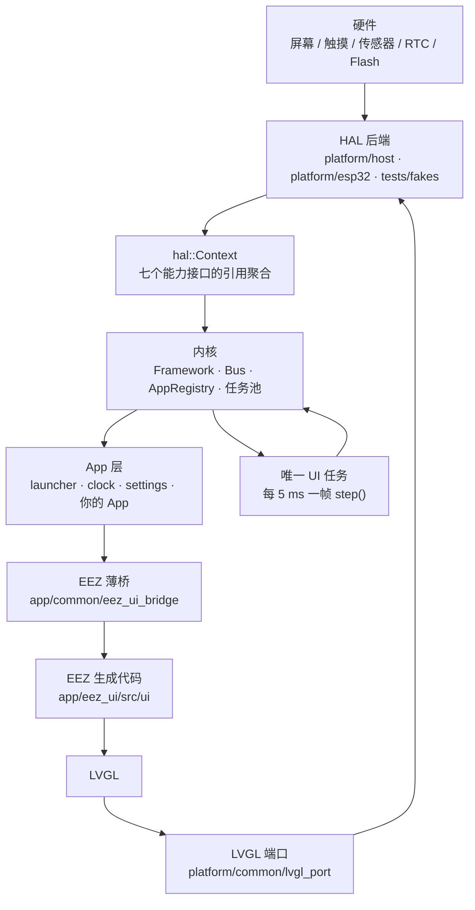
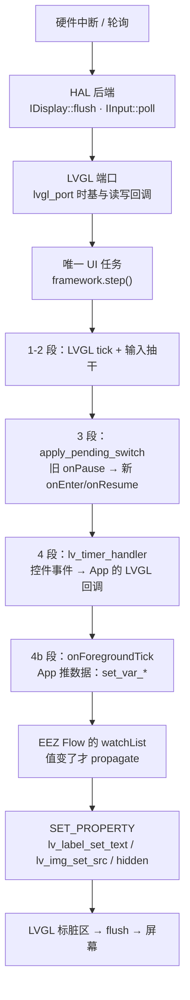

# 原理篇（concepts）：框架是怎么跑起来的

> **这一层回答"为什么"**。读完你就能判断"我这么写对不对"，也能看懂框架内部的取舍。
> 要动手做事去 [../guides/](../guides/quickstart.md)；要查具体数字去 [../reference/](../reference/hooks-and-api.md)。

---

## 一句话

**全系统只有一条主线**：一个唯一的 UI 任务在跑 `framework.step()`（宿主默认 5 ms 一拍）。
所有 App 都是**逻辑模块**，不是任务——它们靠框架在固定时刻调钩子被驱动。
硬件差异由 HAL 的**芯片能力抽象**隔开，所以同一份 App 代码既能跑在 PC 上，也能跑在真机上。

---

## 1. 分层总图

三条边界，一条都不能越：

| 边界 | 规则 | 为什么 |
| --- | --- | --- |
| **App ↛ platform** | `app/` 下**不 include 任何 `platform/` 头**（spec §14.5 的验收项） | 换后端不动 App 代码，靠链接期选择后端实现 |
| **内核 ↛ LVGL** | `embark::core` 不依赖 LVGL；界面通过 `IUiPort` 端口注入 | 无屏平台与单元测试都能跑内核（`ui` 可为 `nullptr`） |
| **App ↛ 生成代码** | App 只调薄桥，不 include `ui.h`/`eez-flow.h` | 重新导出 UI 不该改 C++ 业务代码 |

---

## 2. 一帧数据流：从硬件到控件，再回来

这是**最值得先搞懂的一条链路**——它解释了"我写的值什么时候会出现在屏幕上"。

**三条要记住的性质**：

1. **只有变化会传播**。Flow 的 watch 只在 `value != execState->value` 时往下走，
   所以"每帧无条件写一遍同一个值"是零成本的，不用自己判重。
2. **写进去的值下一帧才上屏**。`set_var_*` 只改全局变量，`visitWatchList` 在
   `eez_flow_tick()` 里跑——而它就在本帧的 4b 段。所以 App 的正确写法是
   **先 `set_var_*`，再 `eez_ui_bridge_tick()`**（顺序反了要等下一帧）。
3. **刷新是按需的**。LVGL 只重画脏区，HAL 的 `flush` 契约是"返回时缓冲区可复用"，
   中间没有双缓冲也没有格式转换。

> 硬件数据（传感器、RTC）进 UI 的完整写法：App 通过 `fw.hal().bus` 拿总线 →
> 自己写驱动 → 存进 App 成员 → 在 `onForegroundTick` 里 `set_var_*`。
> **HAL 只到"收发字节"，不做设备驱动**——这是 [ADR 0002](../adr/0002-hal-capability-granularity.md) 的有意取舍。

---

## 3. 三条主线

想理解框架，按这三条线读就够：

### 主线一：生命周期 —— App 什么时候被调

[app-lifecycle.md](app-lifecycle.md)：boot 九步装配、一帧七段、前后台切换为何"请求只登记"、
三种后台策略各挂在哪里、own task 从创建到回收的完整生命周期。
配套契约表在 [../reference/hooks-and-api.md](../reference/hooks-and-api.md) §1。

### 主线二：消息 —— App 之间怎么说话

[messages-and-background.md](messages-and-background.md)：总线广播（同任务）与收件箱信封（跨任务）
两条路、消息类型怎么定义、三种后台策略怎么选（含判据表）。

### 主线三：可移植性 —— 换一块板子要动什么

[hal-and-portability.md](hal-and-portability.md)：HAL 为什么是这个粒度、
宿主与真机怎么共用一份源码、新平台要提供什么、哪些地方"看起来该抽象但其实不该"。

---

## 4. 术语与文档边界

- **术语表**在仓库根的 [../../GLOSSARY.md](../../GLOSSARY.md)（Arm / Background tick / Own task / 薄壳…），
  每条都带 _Avoid_ 列表——**写代码、写 issue、写文档都用表里的词**。
- **三层的关系**：concepts 说"为什么"，guides 说"怎么做"，reference 说"具体值"。
  三者冲突时，**以 `tests/kernel/` 的契约测试为准**（比任何文档都新）。
- **决策记录**在 [../adr/](../adr/)：每条都写了当时的取舍与被否决的方案。
  想知道"为什么不是另一种做法"，去那里找。

---

## 5. 从这里往哪走

| 你想知道 | 去哪 |
| --- | --- |
| 先跑起来看一眼 | [../guides/quickstart.md](../guides/quickstart.md) |
| 加一个自己的 App | [../guides/new-app-guide.md](../guides/new-app-guide.md) |
| 这个钩子到底什么时候被调 | [../reference/hooks-and-api.md](../reference/hooks-and-api.md) §1 |
| 容量上限是多少、改它会怎样 | [../reference/limits.md](../reference/limits.md) |
| 为什么不能 new / 不能抛异常 | [../adr/0003-no-heap-no-exceptions.md](../adr/0003-no-heap-no-exceptions.md) |
| 为什么只有一个 UI 任务 | [../adr/0001-single-ui-task-logic-apps.md](../adr/0001-single-ui-task-logic-apps.md) |
