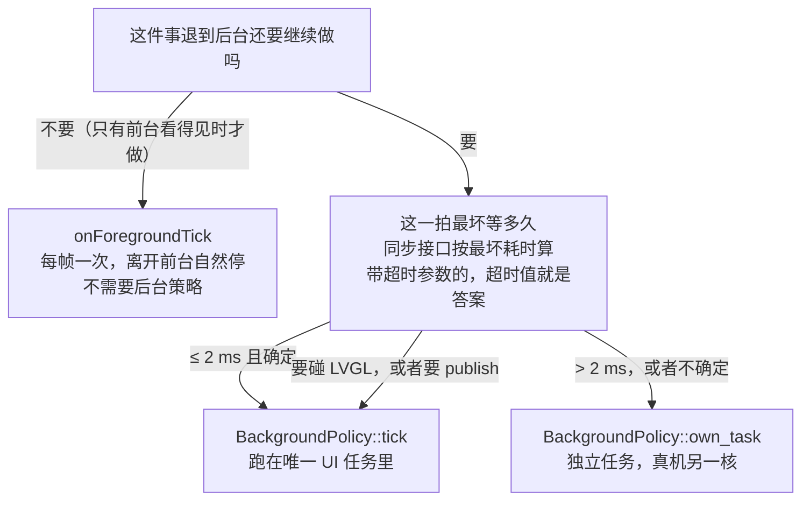

# 消息与后台策略

Embark 里 App 之间**不互相 include、不碰对方符号**（spec §7、issue 08 验收项），
一切协作都走框架的两种消息路径；App 退后台后怎么活，由它自己的后台策略决定。
本文讲"怎么用"，概念与取舍见 `adr/0004-background-tick-and-state-policy.md` 与
[GLOSSARY](../GLOSSARY.md)。

## 消息模型：两条路径

| 路径 | 载体 | 语义 | 什么时候用 |
| --- | --- | --- | --- |
| 总线广播 | `Framework::publish(msg)` / `Bus`（`etl::message_bus`） | 同任务内**同步**：所有已订阅者依次收到 | App 之间、UI 任务内部（前台交互、演示消息） |
| 收件箱信封 | `Framework::post(CrossTaskMessage)` / `MessageQueue` | 跨任务**异步**：单生产者对 UI 任务，UI 任务在循环边界抽干回派 | `own_task` 后台 App 往回发任何东西 |

### 消息类型怎么定义

派生 `embark::MessageT<ID>`，ID 是消息型在进程内的唯一身份：

```cpp
#include <embark/message.h>

// 有基类就不是聚合了，必须显式构造（这和 struct 直觉不同，见 common-pitfalls）
struct BrightnessMessage : public embark::MessageT<0x21> {
  constexpr BrightnessMessage(std::uint8_t level_value = 0) noexcept : level(level_value) {}
  std::uint8_t level = 0;  // 0..3 四档
};
```

ID 分配：`0xFE` 是框架保留的跨任务信封（`CrossTaskMessage`），**不要用**；
demo 用 `0x21`；自己的 App 挑不冲突的值即可，并写进注释。
判断消息身份在接收端：`msg.get_message_id() == BrightnessMessage::ID`
（`MessageT` = `etl::message<Id>`，自带静态 `ID` 与实例 `get_message_id()`）。

### 怎么收消息

App 端**不需要显式订阅**：框架装配阶段给每个 App 挂了一个常驻适配器，
所有广播都会被投递到每个 App 的 `onMessage(const Message&)`。收方自己挑：

```cpp
void MyApp::onMessage(const Message& msg) override {
  if (msg.get_message_id() == BrightnessMessage::ID) {
    const auto& b = static_cast<const BrightnessMessage&>(msg);  // ID 匹配后安全
    level_ = b.level;   // 更新自己的副本
  }
}
```

### 怎么发消息

```cpp
// 同任务内：直接广播（无人订阅会计数 + WARN，不会 blocking）
fw.publish(BrightnessMessage{new_level});
```

own_task App 不能用 `publish`（跨线程！），只能 `post` 信封、回 UI 再进总线：

```cpp
// MyOwnTaskApp::onBackgroundTick（运行在自己的任务里）
fw.post(embark::CrossTaskMessage(id_of(*this), ++seq_));
// 信封回到 UI 任务后按序派发给自己，onMessage 里按 seq 对账
```

`onCreate(Framework& fw)` 里保存 `fw_ = &fw;` 之后用（demo 里叫 `fw_`）。

## 后台策略：三种，每 App 声明一次

`App::settings()` 返回 `AppSettings{策略, 周期, 栈深, 优先级, 武装时机}`（最后一项有默认值，4 字段写法照旧可用）。
注意：**声明 ≠ 一上电就在后台跑** —— 默认在 App **第一次进过前台**那一刻才武装；要"开机就跑"得显式声明 `ArmPolicy::at_boot`（见本节末「武装时机」）：

| 策略 | 语义 | 适合 | 注意 |
| --- | --- | --- | --- |
| `suspend`（默认） | 退后台后完全不跑 | 设置页等纯前台交互 App | 前台钩子正常；后台零开销 |
| `tick` | 每 `period_ms` 进一次 `onBackgroundTick(now_ms)` | 轻量后台逻辑（计时、轮询状态、节流） | 回调在**唯一 UI 任务**里执行：必须轻量、不阻塞；周期向上取整到 UI 循环粒度（宿主 5 ms），`period_ms == 0` 等价 suspend；**武装之后才起跑**（默认"第一次进前台"，`at_boot` 在 `framework.cpp` 的 boot 第 9 步） |
| `own_task` | 框架经 `ITaskSpawner` 从静态池里给你分一个槽、建一个 FreeRTOS 任务，周期跑同一个钩子 | 长阻塞、重计算的活 | 任务在**武装时**才创建（默认"第一次进前台"、不是 boot；`at_boot` 则在 `framework.cpp` 的 boot 第 9 步）； 栈深/优先级自配（demo：256 字 / 优先级 4，低于 UI 任务的 5）；栈深口径是 `StackType_t` 字（宿主 1 字 = 8 字节，真机 xtensa 1 字 = 1 字节，见 `docs/common-pitfalls.md`）；回调运行在你的任务里，**不能碰 UI 对象、不能 `publish`**，回 UI 走 `post` 信封 |

```cpp
// tick 例：clock 每 100 ms 跳一次（宿主每 20 拍）
AppSettings settings() const override {
  return AppSettings{BackgroundPolicy::tick, 100U, 0U, 0U};
}
// own_task 例：ticker 每 50 ms，256 字（StackType_t 字）栈，优先级 4
AppSettings settings() const override {
  return AppSettings{BackgroundPolicy::own_task, 50U, 256U, 4U};
}
```

```cpp
// at_boot 例：闹钟这类"上电就要工作"的 App —— 不等用户点开，boot 第 9 步就武装
AppSettings settings() const override {
  return AppSettings{BackgroundPolicy::own_task, 50U, 256U, 4U, ArmPolicy::at_boot};
}
```

### 武装时机：默认第一次进前台才开跑，`at_boot` 开机就开跑（issue 23 / ADR 0009；issue 24 / ADR 0010）

默认情况下框架**不会**在 boot 时就把所有 App 的后台拉起来：boot 只给 `tick` 策略注册定时器（不 `start`）、
只校验 `own_task` 策略的数量（超 `max_own_tasks` = 装配失败）；真正的「开跑」发生在 App
**第一次进过前台**的那一刻（`onEnter` 之后、同一帧）。默认前台（注册表第 0 个）在 boot 里
就进过前台，所以它当场武装；唯一的例外是 `ArmPolicy::at_boot`（下面第二条）。

- 武装一次即长期有效：之后退回后台（`onPause`）后台照跑 —— 不是「只在前台之外跑」
  （`own_task` 在平台上是常驻任务，没有暂停/恢复这回事）。
- 没被打开过的 App，后台**完全不跑**：用户视角「我没开它，它自己在跑」不再成立。
- 观测：`fw.background_armed(id)`（是否已武装）、`fw.arm_failures()`（运行期武装失败累计）。
- `entered_` / `armed_` 都是 RAM 位（每次开机清零）：默认口径的准确说法是「**每次开机后被
  打开过一次才会跑后台**」。
- **要「开机就开跑」就显式声明**（issue 24 / ADR 0010）：`settings()` 第 5 个字段传
  `ArmPolicy::at_boot` —— boot 第 9 步先武装所有 `at_boot` 的 App（按注册顺序），再武装默认
  前台；**任一轮失败 = 装配失败**（不进循环）。代价是这个 App 的前台可能还没加载过，它的
  后台已经在跑，后台逻辑要自己跳过 UI 相关的事（等 `onEnter` / `onForegroundTick` 之后再做）。

```cpp
AppSettings settings() const override {
  return AppSettings{BackgroundPolicy::own_task, 50U, 256U, 4U, ArmPolicy::at_boot};
}
```
- 机制细节与理由：[app-lifecycle/README.md](app-lifecycle/README.md) 4.1 / 4.2、[adr/0009](adr/0009-background-arm-on-first-enter.md)（默认时机）、[adr/0010](adr/0010-arm-at-boot.md)（`at_boot`）。

常用容器与上限（编译期定死，改在 `config/embark_limits.h`）：`max_apps`、
`max_bus_subscribers`、`max_background_timers`、`message_queue_depth`、`max_own_tasks`
（同时在跑的 `own_task` 上限，也是静态任务池的槽数）。

### 怎么选：先看它要不要退到后台跑，再看这一拍最坏等多久

判据不是"这活重不重"，而是**最坏等多久**——微秒级的寄存器读写放哪都行，毫秒级的等 NMEA / 等网络 /
等 Flash 才是灾难；也不是"周期长不长"——`period_ms` 是 `std::uint32_t` 毫秒，60000（1 分钟）完全合法，
周期长短不影响线程归属：



**耗时速查**（400 kHz I2C 下 1 字节 ≈ 22.5 µs；拿不准就在 App 里量一次）：

| 这一拍要做的动作 | 最坏耗时 | 为什么 | 策略 |
| --- | --- | --- | --- |
| 累加计数、状态机、拼字符串 | 微秒 | 纯 CPU，不碰外设 | `tick` |
| 读一个 I2C 寄存器（1 写 + 1 读） | ≈ 50 µs | 两个字节 + 两次 START/STOP | `tick` |
| 写一个命令字节 | ≈ 25 µs | 一个字节 | `tick` |
| 读 IMU 六轴（12 字节） | ≈ 0.3 ms | 1 字节地址 + 12 字节数据 | `tick` |
| 读触摸一整包（27 字节） | ≈ 0.6 ms | 1 + 27 字节；仓库现状就是每帧在 UI 任务里跑（`platform/esp32/src/esp32_input.cpp` 按 10 ms 节流） | `tick` |
| 大数组运算、图像缩放 | 几十 µs ~ 几 ms | 不阻塞但占 CPU，超过 2 ms 就会拖慢界面 | 超过 `tick` 的账就 `own_task` |
| 读一小段 Flash / 一个 NVS key | 数十 ms | 同步等 flash 操作 | `own_task` |
| 写 NVS / 擦一页 Flash | 几十 ~ 几百 ms | `nvs_set_blob` + `nvs_commit` 都要落盘 | `own_task`（或只在 `onPause` / `onExit` 写一次） |
| 等一句 NMEA（9600 baud 约 70 字节） | ≈ 73 ms | 1 字节 ≈ 1.04 ms | `own_task` |
| 等一次定位有效（GPS 冷启动） | 几百 ms ~ 秒级 | 不受你控制 | `own_task` |
| 网络请求 / MQTT 收发 | 几十 ms ~ 秒级，没有硬上限 | 断网时可能一直等 | `own_task` |
| 音频解码 + 写 I2S | 持续占用 | 要一直跑、不能被打断 | `own_task`，且 `period_ms > 0` |
| 总线故障路径（触摸 50 ms / `IBus` 100 ms 超时） | 到超时值 | 正常路径很短，但"不确定"本身就该按最坏值算 | 按最坏值判 |

**三个校准锚点**（别把 `tick` 的预算想得太宽）：

- UI 循环节拍 = **5 ms**（`config/embark_limits.h` 的 `ui_loop_period_ms`）：一个 `tick` 回调占掉 2 ms，
  这一帧就只剩 3 ms 给 LVGL、触摸和所有 App。
- 框架自己每帧最多花 **≈ 2.6 ms**（一次 flush 40 行 = 25.6 KB，80 MHz SPI，且同步等 DMA 结束，见
  `platform/esp32/src/esp32_display.cpp`）：框架已经用掉这个量级，App 别再往上叠同等量级。
- **触摸驱动就是"每帧在 UI 任务里碰 I2C"的活样本**（`platform/esp32/src/esp32_input.cpp`，10 ms 节流，
  注释写着"给 I2C 让路"）：所以"碰了 I2C 就必须 `own_task`"不成立；它的 50 ms 超时是**故障路径**，
  不是正常耗时。

**三策略对照**：

| 维度 | `suspend` | `tick` | `own_task` |
| --- | --- | --- | --- |
| 跑在哪条线程 | 不跑 | 唯一 UI 任务 | 自己的任务（真机钉核 0，UI 在核 1） |
| 能碰 LVGL 对象吗 | — | 能 | **绝对不能**（跨任务碰 LVGL 未定义） |
| 能 `publish()` 吗 | — | 能 | **不能**，只能 `post` 信封回 UI 再进总线 |
| 并发上限 | — | `max_background_timers` | `max_own_tasks`（默认 2） |
| `period_ms` 语义 | — | 周期；`0` 等价 `suspend` | `> 0` 常驻循环；`== 0` 跑一轮就结束、槽位回收 |
| 栈 | — | 借 UI 任务的（`ui_task_stack_words`） | 自己一份（默认 `own_task_stack_words` = 512 字；宿主 1 字 8 字节 = 4 KB，真机按 `stack_word_bytes` 换成同样的字节数，见 [common-pitfalls.md](common-pitfalls.md)） |
| 周期精度 | — | UI 帧粒度：`ceil(period_ms / ui_loop_period_ms)` | `vTaskDelay`，毫秒级 |
| 超限 / 失败 | — | 装配期定时器表满 → `no_space`；武装时 `start` 失败记 `arm_failures()` | 装配期数量超限 → `no_space`（boot 直接失败）；运行期 `no_space` / `busy` / `unsupported` |

**四个常见误判**：

- 「碰了 I2C / SPI 就必须 `own_task`」——不对：读寄存器、读 IMU 都是微秒~亚毫秒级，触摸驱动每帧就在
  UI 任务里跑。
- 「周期长 = 轻」——不对：1 分钟采一次 GPS，只要这一拍要等 NMEA，照样 `own_task`。
- 「`own_task` 里顺手把界面刷了」——不行：跨任务碰 LVGL 未定义，回 UI 只能 `post` 信封；所以"要刷界面"
  的活默认往 `tick` 靠。
- 「`own_task` 随便开」——只有 `max_own_tasks`（默认 2）个槽：GPS 收 + 音乐播放就占满了，第三个
  `own_task` App 会在装配期 `no_space`，让 boot 直接失败。稀缺资源要用在真正会等的地方。

> 一句话：**要刷界面或发广播 → `tick`；会等（毫秒级或不确定）→ `own_task`；只有前台才需要 →
> 连后台策略都不用声明。**

## own_task 的生命周期：入口返回 = 结束

`own_task` 不是"建了就常驻"：**入口函数返回 = 任务结束**。框架的 trampoline 把这个槽位标成
`finished` 并让任务 park 住（不再被调度），`Framework::step()` 每帧在回收段把槽位还给静态池 ——
之后同一个 App 可以再创建一次，槽位复用、世代号 +1（"创建 → 跑完 → 回收 → 再创建"能反复走）。

```cpp
// 常驻写法：period_ms > 0，框架按周期反复调 onBackgroundTick
AppSettings settings() const override {
  return AppSettings{BackgroundPolicy::own_task, 50U, 256U, 4U};
}

// 一次性写法：period_ms = 0，框架只调一轮 onBackgroundTick，返回后任务就结束
AppSettings settings() const override {
  return AppSettings{BackgroundPolicy::own_task, 0U, 256U, 4U};
}

// 运行期再创建一次：只能在 UI 任务里、boot 之后 shutdown 之前调用
const embark::Error err = fw.spawn_own_task(fw.id_of(*this));
// none / not_found / not_ready / unsupported / no_space / busy
```

三条纪律：

- **回收只能由持有者做**，持有者就是唯一 UI 任务（它也是唯一调 `spawn_task` 的人）。任务自己删
  自己会走 FreeRTOS 的"删除中"分支（静态 TCB 要等空闲任务才真正释放），此时复用存储会写出
  致命别名。`ITaskSpawner::release_task` 只给持有者用，任务内部不要碰。
- **池满就是 `no_space`**，不排队、不降级：同时在跑的 `own_task` 上限 = `max_own_tasks`（静态池的
  槽数），超了直接拒绝创建。失败点唯一且确定是刻意的，见 `adr/0005-static-task-slots-and-pool.md`。
- **别在自己的任务里等结果**：要等外部事件（WiFi 连接、超时）就阻塞在自己的任务里，成功或超时后
  `return`，槽位自然回收 —— UI 全程不被阻塞。这正是"运行期创建、完成即回收"的第一个真实用例。

观测：`fw.own_tasks_spawned()` / `fw.own_tasks_released()` 是累计创建/回收计数；任务池自身的
`running() / finished() / free_slots()` 在 `platform/common/pooled_task_spawner.h` 上。系统用例见
`tests/kernel/test_own_task_lifecycle.cpp`（一次性 job、池满回滚、常驻不回收、`ArmPolicy::at_boot`
开机即武装共四个用例）。

## 演示对照
`app/launcher/`（主屏 + 导航接线）、`app/clock/`（tick 100ms + 状态机 + 收 `BrightnessMessage`）、`app/settings/`
（suspend + `publish` 亮度消息 + `bump_level` 逻辑入口）就是最小可读范本；`app/common/app_messages.h` 定义了
`BrightnessMessage`。**这三个 App 都没声明 `own_task`**：后台演示只有 `clock` 的 `tick`，`own_task` 的
完整系统用例在 `tests/kernel/test_own_task_lifecycle.cpp`（宿主演示 `ui_demo` 仍按这 3 个 App 注册）。